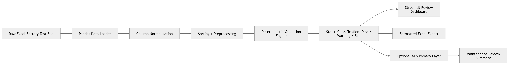

# Battery Test Preprocessing Demo

This package contains synthetic Excel data and a starter Streamlit app for preprocessing substation backup DC battery test results.

## Files

- [raw_substation_battery_test_export.xlsx](raw_substation_battery_test_export.xlsx) — example raw substation battery test export.

- `requirements.txt` — packages needed for the demo.

## Run

```bash
pip install -r requirements.txt
```
## System Architecture


## Demo workflow

1. Read Excel sheets with pandas.
2. Normalize column names.
3. Validate required fields.
4. Classify cell readings using demo thresholds.
5. Combine string-level and cell-level results.


## Production upgrade ideas

- Replace demo thresholds with manufacturer-specific limits.
- Add trend analysis by substation, battery string, and cell number.
- Add anomaly detection for cells drifting from their historical baseline.
