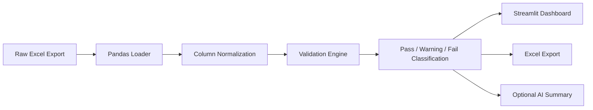
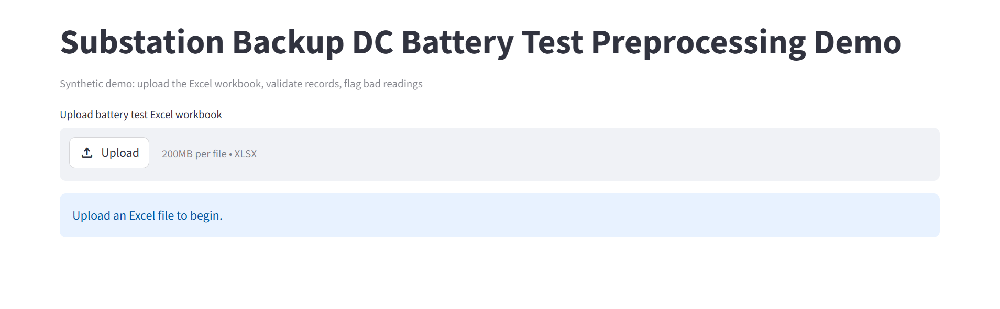
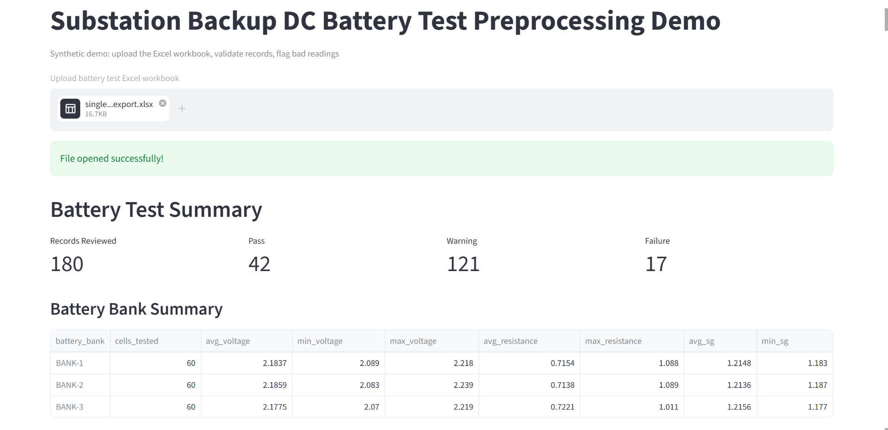
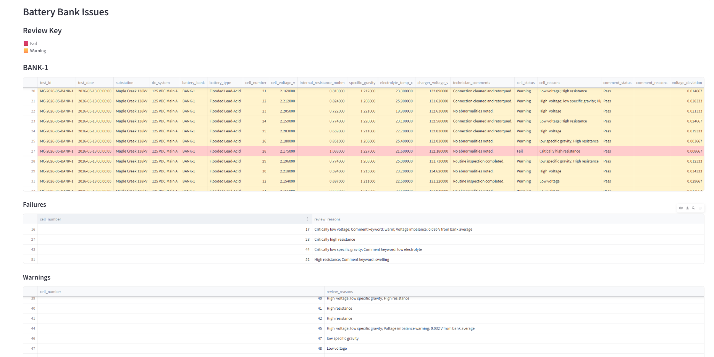
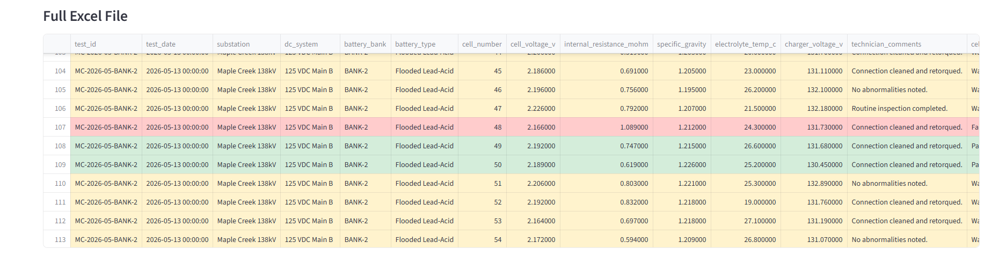
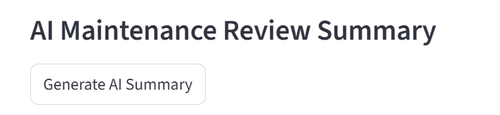
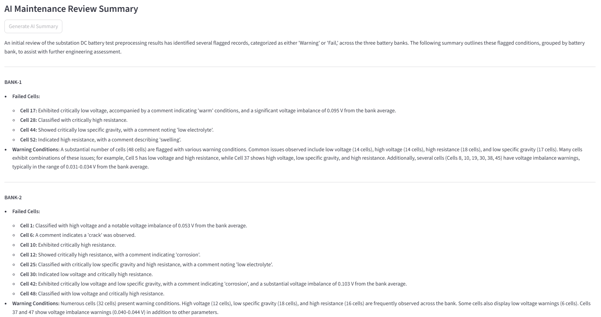

# Battery Test Preprocessing Demo

A Streamlit-based engineering workflow tool for preprocessing, validating, and reviewing substation backup DC battery test data.

## Engineering Concepts Demonstrated

- Deterministic engineering validation pipelines
- Threshold-based fault classification
- Voltage imbalance detection
- Review-state aggregation
- Engineering workflow automation
- Human-readable maintenance summaries
- Optional AI-assisted review generation

## Deterministic Validation Philosophy

- All pass/fail classifications are generated using deterministic engineering rules and configurable thresholds.

## Tech Stack

- Python
- pandas
- Streamlit
- openpyxl
- regex (re)
- Gemini API (optional AI summary layer)

## System Architecture


## Files

- [raw_substation_battery_test_export.xlsx](raw_substation_battery_test_export.xlsx) — example raw substation battery test export.

- `requirements.txt` — packages needed for the demo.

## Run

```bash
pip install -r requirements.txt
```

## Demo workflow

1. Read Excel sheets with pandas.
2. Normalize column names.
3. Validate required fields.
4. Classify cell readings using demo thresholds.
5. Combine string-level and cell-level results.

## App
### Landing Page

### Summary View

### Bank Issues 

### Full Excel Form

### Optional AI Summary



## AI Review Prompt

The optional AI maintenance summary layer uses a constrained
engineering-focused prompt. The AI does **not** make maintenance
decisions or override deterministic classifications.

```python
prompt = f"""
You are assisting an electrical utility asset maintenance engineer
reviewing backup substation DC battery test preprocessing results.

Rules:
- Do not make final maintenance decisions.
- Do not override the deterministic pass/warning/fail classifications.
- Summarize only the flagged records.
- Use cautious engineering language.
- Organize the summary by battery bank.

Flagged battery test records:
{ai_input}

Write a concise engineer-facing review summary.
"""
```


## Production upgrade ideas

- Replace demo thresholds with manufacturer-specific limits.
- Allow user to define threshold limits
- Allow user to download annotated excel file
- Add ability for historical data comparision and trend visualization
